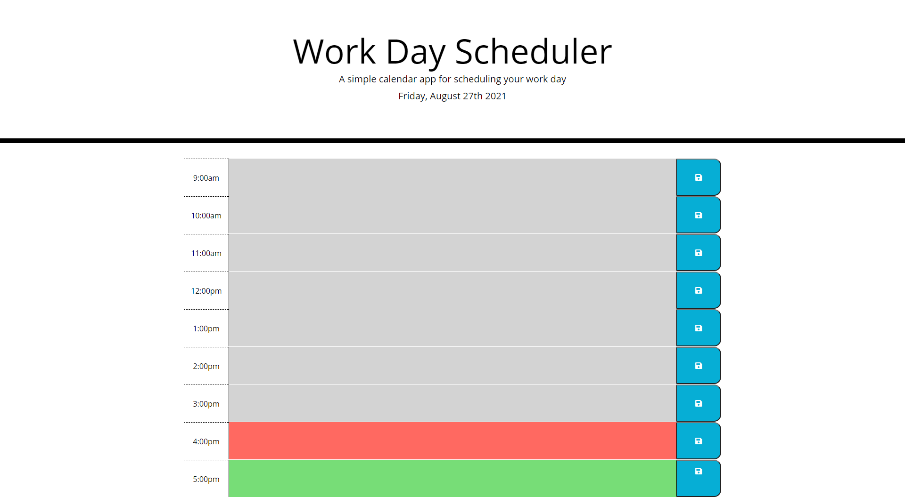

# study-day-planner

## Description
1. Added the Moment js. that displays the current day of the week, month and year . 
2. Added Time blocks with standard 9-5 hours. 
3. Color coded the hours.

## Links
1. [Homework Deployed Website link](https://liladobe.github.io/study-day-planner/)
2. [Github](https://github.com/LilAdobe/study-day-planner)
## Screenshot

